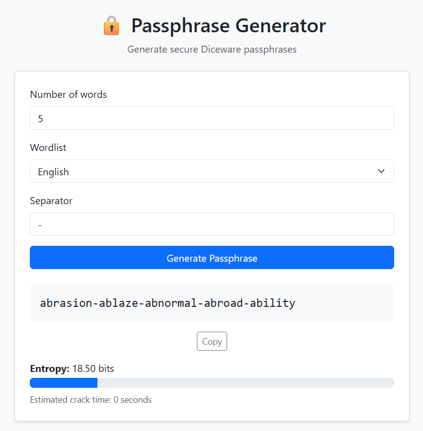

# 🔒 Diceware Passphrase Generator

A simple, secure **Diceware passphrase generator** built with **HTML, JavaScript and Bootstrap 5**.

This tool generates strong, memorable passphrases using the Diceware method and calculates their **entropy and estimated crack time**.

It runs **completely offline**, requires **no backend**, and can be used locally or directly via **GitHub Pages**.

---

## 🌐 Live Demo

You can use the generator directly here:

**👉 https://elianAlde.github.io/passphrase-generator/**

---

## 📸 Screenshot



---

## ✨ Features

* 🔑 Generate secure **Diceware passphrases**
* 🎲 Uses **cryptographically secure randomness** (`crypto.getRandomValues`)
* 📊 Calculates **entropy in bits**
* ⏳ Estimates **brute-force crack time**
* 📋 One-click **copy to clipboard**
* 🌍 Supports multiple **wordlists**

  * English
  * Italian
* ⚡ **Fully offline** (no server required)
* 🎨 Clean UI built with **Bootstrap 5**

---

## 🧠 How Diceware Works

The Diceware method generates passphrases by randomly selecting words from a predefined wordlist.

Each word contributes entropy depending on the size of the dictionary.

For example, using a wordlist of **7776 words**:

```
entropy per word ≈ log2(7776) ≈ 12.9 bits
```

Example passphrase:

```
forest-hammer-orbit-lotus-mirror
```

Entropy estimation:

```
5 words × 12.9 bits ≈ 64.5 bits
```

Which is considered **strong for most use cases**.

---

## 🔐 Security Notes

This generator uses:

```
crypto.getRandomValues()
```

instead of `Math.random()` to ensure **cryptographically secure randomness**.

No passphrases are stored, transmitted, or logged.

Everything happens **locally in your browser**.

---

## 📂 Project Structure

```
passphrase-generator
│
├── index.html
├── app.js
├── wordlists.js
├── style.css
└── screenshot.png
```

---

## 🚀 Running Locally

Simply open:

```
index.html
```

in your browser.

No server or installation is required.

---

## 🛠 Technologies Used

* HTML5
* JavaScript (ES6)
* Bootstrap 5
* Web Crypto API

---

## 📜 Wordlists

Wordlists are based on the Diceware concept and contain thousands of possible words to ensure strong entropy.

---

## 📄 License

MIT License

---

## ⭐ If you like this project

Feel free to **star the repository** and share it!
